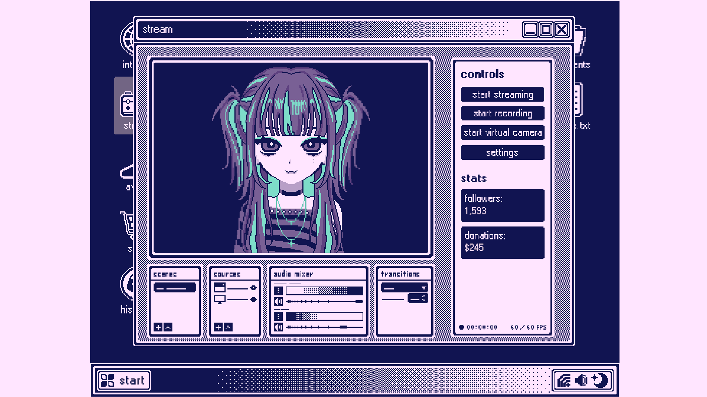

# VIRTUAL_GIRL.EXE
**VIRTUAL_GIRL.EXE** is a streamer simulation game where you step into the shoes of an up-and-coming VTuber aiming to become the most popular VTuber on the internet! Customize your character, unlock and purchase even more outfits, and watch your virtual persona grow in fame.

## Gameplay
- Host live streams, keep up with chat by typing phrases in time, and rack up followers and donations to grow your virtual fame.
- Test your WPM speed in a fun "Hisscord" typing minigame.
- Customize your character's hairstyle and outfit, and unlock more options in the in-game shop.
- Watch your audience come alive with a dynamic chat feed. Fun, randomized chat messages scroll in real time.
- Easy, Medium, and Hard difficulty levels add challenge to the game. See if you can keep up with longer and more complex typing challenges!

## Features
- **Animated Stats:** Followers and donations update with cute, eye-catching animations.
- **Real-Time Typing Feedback:** Letters light up as you type, keeping your WPM and accuracy fun and interactive.
- **Shop & Unlockables:** Spend your hard-earned donations on new hairstyles and outfits.
- **Nostalgic UI:** Play through playful windows that you can drag and overlap, giving the interface a fun, nostalgic feel.
- **Custom Art Assets:** Every character, interface element, and animation was carefully crafted from scratch.
- **Persistent Progress:** Keep your VTuber’s stats across sessions, so your fame always grows.
 

